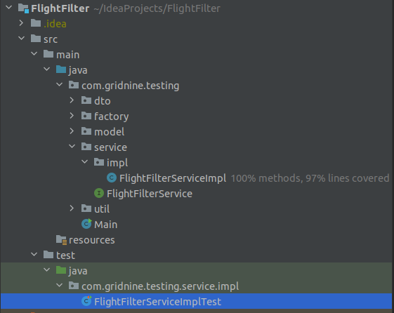

### Задача

Имеется некая система, которая обрабатывает авиаперелёты.

Перелёт — это перевозка пассажира из одной точки в другую с возможными промежуточными посадками.

Это значит, что перелёт можно представить как набор из одного или нескольких элементарных перемещений, называемых сегментами.

Сегмент — это атомарная перевозка, которую для простоты будем характеризовать всего двумя атрибутами: дата/время вылета и дата/время прилёта.

Ваша задача — написать модуль, который будет заниматься фильтрацией набора перелётов согласно различным правилам.

- Правил фильтрации может быть очень много.
- Наборы перелётов также могут быть очень большими.
- Правила могут выбираться и задаваться динамически в зависимости от контекста выполнения операции фильтрации.
### Что нужно сделать?
Продумайте структуру модуля, создайте необходимые классы и интерфейсы. Если знакомы с JUnit — покройте свой код тестами. Пользовательский интерфейс не рассматривайте. Достаточно вывода информации в консоль. Никаких сторонних библиотек использовать не нужно.

### Что нужно учесть?
1. Приложенный файл TestClasses.java содержит упрощённые модельные классы и фабрику для получения тестовых образцов. Весь код необходимо поместить в пакет com.gridnine.testing.
Скачать файл можно тут: [TestClasses.java](https://drive.google.com/uc?export=download&id=1HXH31MNlJuKK0H4t0jM5IQmP18X5FhOX)
2. Для проверочного запуска создайте публичный класс Main c методом main(). Этот метод должен выдать в консоль результаты обработки тестового набора перелётов. Получить тестовый набор нужно методом FlightBuilder.createFlights().
3. Исключите из тестового набора перелёты по следующим правилам (по каждому правилу нужен отдельный вывод списка перелётов):
- Вылет до текущего момента времени.
- Сегменты с датой прилёта раньше даты вылета.
- Перелеты, где общее время, проведённое на земле, превышает два часа (время на земле — это интервал между прилётом одного сегмента и вылетом следующего за ним)

В итоге был реализован модуль, который будет заниматься фильтрацией набора перелётов согласно различным правилам.

Из тестового набора исключены все перелёты по требуемым правилам и по каждому из них предоставлен вывод отдельным списком.

Также сервисный слой бизнес-логики был протестирован почти на 100% с помощью библиотеки JUnit.
